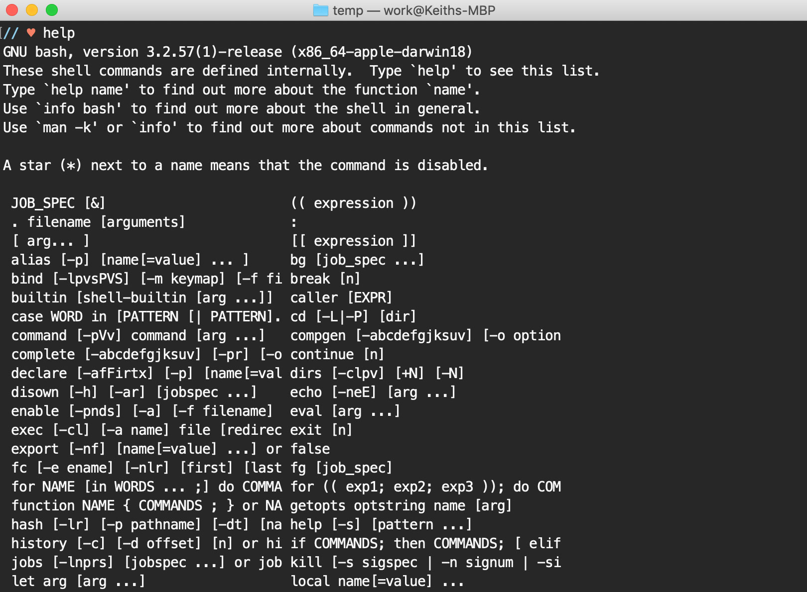

Using Terminal to get or send information can be a challenging experience for novice developers. Most have only interacted with their computer through a GUI and will quickly feel defeated by the empty box with a blinking cursor. After all, the only thing worse than nothing, is everything.

Guiding a user through your program with selectable options or commands can provide a much better experience than asking them to type their own. Likewise, you may be able to build a better program if you're able to plan for the exact inputs you'll receive from your users.

##Introducing TTY::Prompt
[TTY::Prompt](https://github.com/piotrmurach/tty-prompt#ttyprompt- "TTY::Prompt Github") is described by its developer as "A beautiful and powerful interactive command line prompt." It is part of [an entire suite](https://piotrmurach.github.io/tty/ "TTY suite") of Ruby gems designed to help you build better, more functional command line apps. It provides several alternatives to **gets.chomp** for receiving input from your users, which would otherwise require many more lines of code to accomplish.

##How Do I Use It?
[The TTY::Prompt GitHub page](https://github.com/piotrmurach/tty-prompt#ttyprompt- "TTY::Prompt documentation") has great documentation, but let's take a look at basic setup and some examples.

###1. In Terminal, `cd` into a project folder.
~~~ruby{numberLines: true}
# install the gem
gem install tty-prompt 

# create a new file
touch ttyprompt.md
~~~
###2. Open **ttyprompt.md** in your code editor
~~~ruby{numberLines: true}
# require the gem
require 'tty-prompt' 

# create a new instance
prompt = TTY::Prompt.new
~~~
###3. Do fun stuff!
~~~ruby{numberLines: true}
# get a string
prompt.ask("What is your name?")

# require input
prompt.ask("What's your phone number?", required: true)
# >> Value must be provided

# validate with regex
prompt.ask('What is your username?') do |q|
  q.validate /^[^\.]+\.[^\.]+/
end

# built-in email validation
prompt.ask('What is your email?') { |q| q.validate :email }
~~~
**prompt.ask** works like **gets.chomp**, but saves you the step of **puts**ing out your question. You can easily [modify](https://github.com/piotrmurach/tty-prompt#217-modify) details of the return, if you need do do things like **upcase** or **trim** whitespace.

~~~ruby{numberLines: true}
prompt.yes?("Do you like Ruby?")
# => (Y/n)
~~~
**prompt.yes** returns true or false

~~~ruby{numberLines: true}
prompt.mask("What is your password?")
# => ••••••••
~~~
**prompt.mask** hides a user's input but returns plain text.

~~~ruby{numberLines: true}
question = "What's your favorite fruit?"
choices = ["Apples", "Bananas", "Pears"]
# or [{"Apples", 1}, {"Bananas", 2}, {"Pears", 3}]

prompt.select(question, choices])
# => What's your favorite fruit? (Use ↑/↓ arrow keys)
# => ‣ Apples
# =>   Bananas
# =>   Pears
~~~
This last example, **prompt.select**, prompts a user to use the up/down arrow keys and press enter to make their selection. You can pass that selection as a variable to do whatever you need to next. You can customize the cursor, change colors, build multi-selects, and lots more.

~~~
prompt.select("What's your favorite fruit?") do |prompt|
  prompt.choice "Apples", apple
  prompt.choice "Bananas", banana
  prompt.choice "Pears", pear
end
~~~
There are several different ways to write a **prompt.select** statement. A second value may be passed alongside the string that is shown on screen. If that selection is made, *the second value* will be returned. It can be anything from a different string, to an integer, to an object, depending on your need.

These examples only scratch the surface, so if you're building a command-line application in Ruby, be sure to check out [TTY::Prompt](https://github.com/piotrmurach/tty-prompt#ttyprompt- "TTY::Prompt docs").
