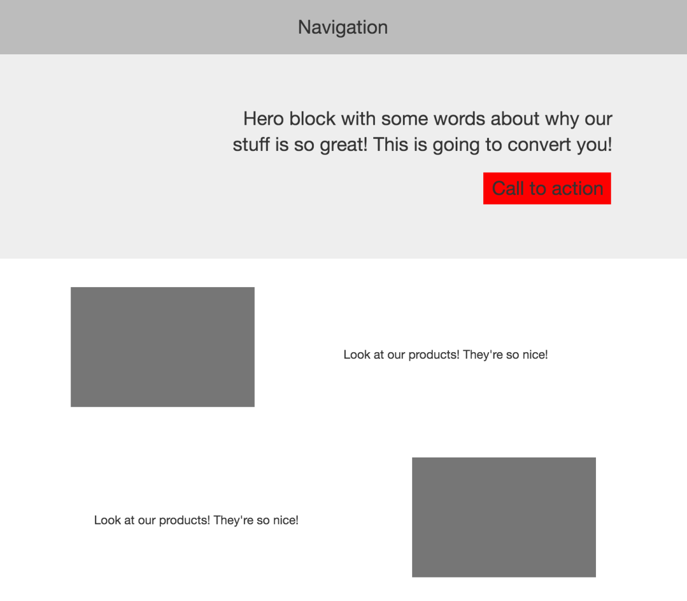
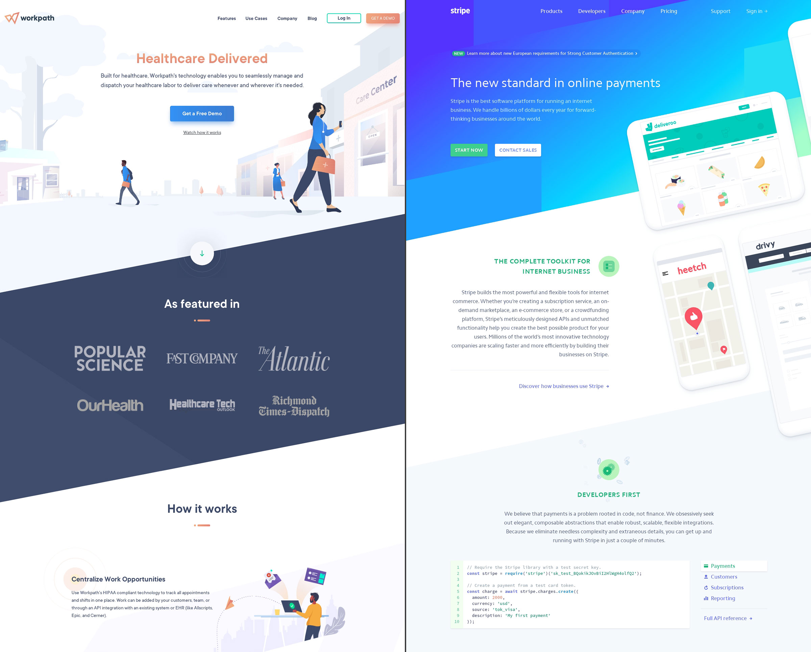
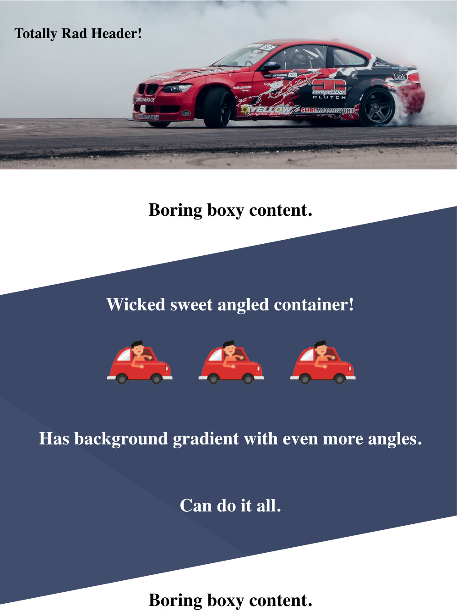

You're probably quite familiar with the standard tech company / start-up website. It's got a big shiny rectangle at the top, then a series of less exciting but more informative rectangles all the way down. Sometimes within these rectangles, the images and text alternate from left to right as you scroll down. There is usually a clear division between these rectangles.


Source: [Web design is now completely boring](https://thenextweb.com/opinion/2015/09/23/zzzzzz/)

Why is this the standard look? Well, it _is_ pretty. It's airy. A user will appreciate the ease of navigation and the rhythmic flow, especially on a mobile device. [Apple does it](https://www.apple.com/iphone/), and they're better at marketing than almost anyone.

Another big reason: [Bootstrap](https://getbootstrap.com/), which is the most popular web design framework by [a _massive_ margin](https://trends.builtwith.com/docinfo/design-framework/traffic/Entire-Internet). Bootstrap is efficient because it caters to what the browser does most naturally. Block level elements span the full width of the screen and stack on top of each other.

## Introducing, Angles

Know what's safe? Driving your car in a straight line. Know what's awesome and dangerous? [Powersliding that sucker sideways](https://www.youtube.com/watch?v=4h1h1cO4BV8) with your steering wheel turned the opposite direction you're headed. The longer you can pull this move off without crashing into a telephone pole, the more you win.

Some of my favorite looking websites take the standard tech web design and kick it out sideways.Sections blend together more smoothly and it's hard to tell where one of those rectangles begins and the next one ends.


[Workpath.co](https://www.workpath.co/) & [Stripe.com](https://stripe.com/)

So how do you do it? How do you turn these sections sideways without affecting the text? If you're into triangles, how would Xzibit put triangles inside your triangles?

## The `::before` pseudo-selector.

The `::before` selector [creates a pseudo-element](https://developer.mozilla.org/en-US/docs/Web/CSS/::before) that becomes the first child of your selected element. You must use the property `content: " "` to "initialize" it, and then you can do whatever you want with it. You can give it text, you can give it background properties, and you can position it. It has a sister selector, `::after`, for putting content "in front of" or "above" an element.

To acheive our angled background, we set the position of `.container-class::before` to absolute, height and width to 100%, and in our case, add a `transform: skewY(-11deg)`, or whatever angle you'd like, and any background styling or transforms.

By placing this container inside a relative-positioned parent, our absolutely-positioned pseudo element will stay within the confines of that parent. The 100% height and width means it will fill the parent completely, while displaying our background properties "behind" it. We'll add a final container, for our actual content, inside the angled container. If we skew the ::before pseudo-element, it will not skew our content. The pseudo-container will also grow and shrink to match the content inside.

All in all, the HTML looks like this:

```html{numberLines: true}
<div class="parent-container">
  <div class="angled-container">
    <div class="content-container">
      // text and image tags here
    </div>
  </div>
</div>
```

And the CSS looks roughly like this:

```scss{numberLines: true}
.parent-container {
  position: relative;
  width: 100%;
}
.angled-container {
  content: " ";
  position: absolute;
  height: 100%;
  width: 100%;
  transform: skewY(-11deg);
  background: blue;
}
.content-container {
  // any text styling
}
```

To acheive more angles within our angles, the background of our `.angled-container` will utilize a [CSS gradient](https://cssgradient.io/) with no transitions between colors.

[Check out my CodePen](https://codepen.io/keefblurgu/pen/zYYrbQm) to see it in action.

