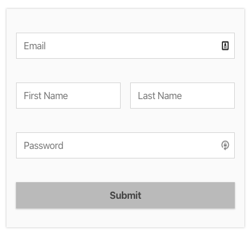
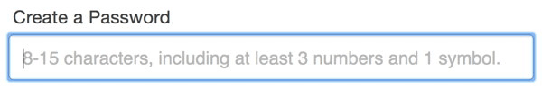
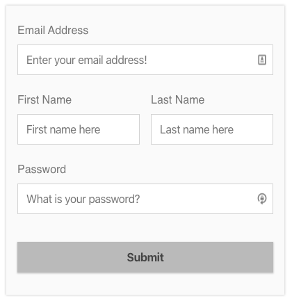
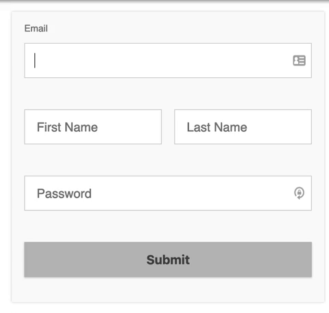

HTML5 arrived in the fall of 2014 and web developers rejoiced over its new tags, simplified markup, and built in abilities that previously required JavaScript. A favorite among many was the [the placeholder attribute](https://html.spec.whatwg.org/multipage/input.html#the-placeholder-attribute).

The placeholder is a word or phrase that describes the purpose of a form field to a user. It sits directly inside the form input until a user starts typing, and then it disappears. It's as simple to use as adding `placeholder="Your Name Here"` to your input. It's a great attribute for making for your form look neat and tidy.



## Maybe A Little Too Tidy

Since the placeholder looks and acts so much like a [label](https://developer.mozilla.org/en-US/docs/Web/HTML/Element/label), it's often used in place of one, and this is bad. The `<label>` tag creates an association between the word and the input, either via wrapping the tag or using the "for" and "id" attributes.

```html{numberLines: true}
<label for="name"> <input type="text" id="name"/></label>
```

This syntax is better, and more [accessible](https://developer.mozilla.org/en-US/docs/Learn/Accessibility/HTML) for a few reasons:

- It is easier for screenreaders to interpret.
- It creates a larger clickable area. Clicking the label will now place the focus inside the proper input.
- A label persists. The placeholder disappears when you type, leaving no reference to what the input requires.



The placeholder has so many other accessibility problems that we probably shouldn't be using them at all. For more: [Don’t Use The Placeholder Attribute — Smashing Magazine](https://www.smashingmagazine.com/2018/06/placeholder-attribute/)

## Mixing Labels with Placeholders

The animated gif above combines a label with a placeholder. If it weren't for the obvious shortcoming demonstrated in that gif, there are times when this seems like it could be really useful. There are other times when combining the two would just be redundant.



## Best of Both Worlds

Using some CSS (and no JavaScript), we can create a really slick looking form with accessible labels that act like placeholders. Check out [this CodePen](https://codepen.io/keefblurgu/full/PoobBdd) for the finished product below.



### 1. Create Your HTML form.

```html{numberLines: true}
<form>
  <label for="email" />Email
  <input type="email" id="email" />
  <input type="submit" value="submit" />
</form>
```

This is a working, accessible form. The email label and email input are associated.

### 2. Wrap the label around the input.

```html{numberLines: true}
<form>
  <label for="email"
    >Email
    <input type="email" id="email" />
  </label>
  <input type="submit" value="submit" />
</form>
```

This syntax is an alternate to using the for/id relationship. Clicking the Email label will put focus on the Email input. We're leaving the association, but you don't have to. The main reason for wrapping the tag is that soon we will use the label for positioning.

### 3. Wrap the label in a span and move it below the input.

```html{numberLines: true}
<form>
  <label for="email">
    <input type="email" id="email" />
    <span>Email</span>
  </label>
  <input type="submit" value="submit" />
</form>
```

The word inside the span tag, Email, will be our placeholder and our label. Putting it below the input will allow us to target it via CSS with the [adjacent sibling combinator](https://developer.mozilla.org/en-US/docs/Web/CSS/Adjacent_sibling_combinator) (the plus sign) after a change has been made to the input.

### 4. Add a fake placeholder

```html{numberLines: true}
<form>
  <label for="email">
    <input type="email" id="email" placeholder=" " />
    <span>Email</span>
  </label>
  <input type="submit" value="submit" />
</form>
```

This is where things get a little funky. With CSS alone there is no way to check that the value of an input has changed. There is [a trick out there](https://stackoverflow.com/questions/3617020/matching-an-empty-input-box-using-css) that uses the required attribute and allows styling based on whether or not the input is valid. The problem with that is that an email input will be invalid until it has an @ sign in it, and we won't get the behavior we're looking for.

Because of the way placeholders work, there's already a built in event listener that says, when a user starts typing, hide the placeholder. We can act on that with the CSS pseudo-selector `:placeholder-shown` or its inverse `:not(placeholder-shown)`. To make it work, you must have an empty space between the quotes, as shown in the code block.

### 5. Position the span with CSS

This is where the magic happens. There's a lot here, but it's actually not that complex.

For each form field, our HTML structure is **label > input + span**. Input and span are children of label and siblings of each another. Our span will be positioned absolutely, so its parent, the label, must have a `position: relative;` property. This means that the coordinates of our absolutely positioned span will be relative to the label, and not the webpage itself.

This is where we have to do some math. By using absolute positioning, we can put the span tag anywhere inside the label. It will appear to start inside the input and it will move into the empty space above the input.

Absolutely positioned elements do not influence other elements. Because it will not push the input down, we need to pre-define space above the input that our span will move into.

Additional CSS is required for the form itself, so [see the CodePen](https://codepen.io/keefblurgu/pen/PoobBdd) if you are interested. Here's a breakdown of everything that goes on inside the label:

```scss{numberLines: true}
label {
  // essential for absolutely positioning our span later
  position: relative;

  // add space between rows
  margin-bottom: 1rem;

  // leave space above the label for our span
  padding-top: 0.75rem;

  // fill the full width of the form
  width: 100%;

  input {
    // leave a gap between the the label and the input
    margin-top: 0.75rem;

    // add white space inside the input
    padding: 0.75rem;

    // width of the input relative to its container (the label)
    width: 100%;

    // part of the math for positioning the span
    font-size: 1rem;

    /* span as placeholder
    ----------------------- */
    + span {
      // absolutely position within the label
      position: absolute;

      // Create a smooth transition into the "label" position
      transition: all 150ms;

      // Position the span "inside" the input
      top: 2.5rem; // margin-top + padding-top + font-size
      left: 0.75rem; // match the padding inside the input
    }

    /* span as label
    ----------------------- */
    // a span that follows a focused input
    &:focus + span, 
    // a span following an input where placeholder is not shown.
    &:not(:placeholder-shown) + span {
      // move to the top left corner of the label
      top: 0;
      left: 0;

      // font size matches padding-top of the label
      font-size: 0.75rem;
    }
  }
}
```

Now that's one classy, accessible form.

[](https://codepen.io/keefblurgu/full/PoobBdd)
