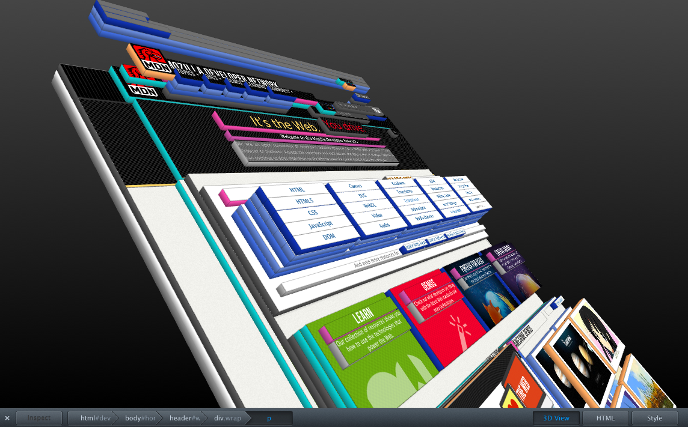

Whether writing into **erb** files for Ruby on Rails or **jsx** files for React, anything you code for the web will have been converted into HTML by the time it's being read by a browser. It's important to have a foundation in HTML.

##Taking it From the Top

~~~html{numberLines: true}
<!DOCTYPE html>
<html>
<head>
  <meta charset="UTF-8">
  <meta name="viewport" content="width=device-width, initial-scale=1.0">
  <meta http-equiv="X-UA-Compatible" content="ie=edge">
  <title>Page Title</title>
  <meta name="description" content="Search engines love me!">
  <meta name="keywords" content="I,don't,work,anymore">
  <link rel="icon" href="tab-icon.png" sizes="32x32" >
  <link rel="stylesheet" type="text/css" href="theme.css">
  <script src="scripts.js"></<script>
</head>
<body>
  <!-- Content for humans goes here -->
</body>
</html>
~~~

HTML, *hypertext markup language*, is code for an HTML document.

The HTML document is split up into **\<head\>** and **\<body\>** sections (just like you!) For the most part, the **head** is for robots, and the **body** is for your audience. Both are wrapped up in an **\<html\>** tag that you'll never think about.

##The Head
~~~html
<DOCTYPE HTML PUBLIC "-//W3C//DTD HTML 4.01 Transitional//EN" "http://www.w3.org/TR/html4/loose.dtd"> 
~~~
The DOCTYPE looks so innocent today but used to be a crazy monster string that no one could have remember.

~~~html{numberLines: true}
<!DOCTYPE html>
~~~
Today, with HTML5, this is all we need.

~~~html{numberLines: true}
<meta charset="UTF-8">
~~~
This line tells the browser what type of characters we'll be encoding. You don't need to memorize it.

~~~html{numberLines: true}
<meta name="viewport" content="width=device-width, initial-scale=1.0">
~~~
**Viewport** is the term for your screen. More specifically, the browser window on your screen. It determines the default zoom level and whether or not a user can pinch and zoom on a touch device. It's actually pretty important, and without it, your smartphone users are gonna have a bad time and your responsive design won't work.

~~~html{numberLines: true}
<meta http-equiv="X-UA-Compatible" content="ie=edge">
~~~
This weirdo is for Internet Explorer. IE has always played by its own special rules and this tag asks it to please behave more like Chrome and Firefox. It was more important when Internet Explorer 8, 9, and 10 were being used. Microsoft has discontinued support for those browers and we are near a time when this tag is not necessary.

~~~html{numberLines: true}
<title>Page Title</title>
~~~
**\<title\>** will be shown in your browser tag, as the name of your website in search engine results, and as the name of your website when someone shares it on social media.

~~~html{numberLines: true}
<meta name="description" content="Search engines love me!">
~~~
**Description** is a short (~150 characters) *description* of your website that is shown in search engine results and on social media. It's important for SEO.

~~~html{numberLines: true}
<meta name="keywords" content="don't, use, these">
~~~
**Keywords** were very important a long time ago and are not used today. People used them to game the SEO system and so Google took them away. For a time, this was why we couldn't have nice things. Now search engines are so advanced that they probably understand the purpose of your website better than you do.

~~~html{numberLines: true}
<link rel="icon" href="tab-icon.png" sizes="32x32" >
~~~
This is the icon that is shown in the browser tab for your website. There are different ways to set it, like including an appropriately named file in your root directory. You can set different images for different screen densities and device types, and you can set images to be used as smartphone icons in the event that someone saves your website as an app.

~~~html{numberLines: true}
<link rel="stylesheet" type="text/css" href="theme.css">
~~~
This is a link to a stylesheet. You can have more than one. CSS stands for **Cascading Style Sheets**, which means styles load from the top and *cascade* towards the bottom. A duplicate style set further down will over-ride a style at the top, and the order the sheets are loaded matters. Unlike JavaScript, this should *always* go in the head, or your website will load without any styles applied.

~~~html{numberLines: true}
<script src="scripts.js"></<script>
~~~
This is a JavaScript file. Sometimes, to function correctly, these files are included in the **\<head\>**. When not necessary, it's better to put them in your footer, because the browser loads your website from the top down and a large JavaScript file in the head can mean a slow page load.

##The Body
~~~html{numberLines: true}
<body>
  <!-- Content for humans goes here -->
</body>
~~~
All the rest code that follows goes into the body. This includes the **\<header\>** and **\<footer\>** (neither of which are necessary tags). It also typically includes your **javascript** at the very bottom, just before the closing tag. There should be nothing between the closing **\</body\>** and closing **\</html\>** tags.

###First, Containers
Every element of a website is, or is in, a box, more commonly referred to as a container. Even if you manage to make a circle with CSS, on inspection you'll see that the circle is still contained within a four-corner box. The **Document** itself is the top level container, followed by the **html** tags, the **body**, and then any **divs** or other elements that follow.

These boxes are broken into two main categories: **Block-level** and **Inline**.

###Block-Level Elements
By default, block-level elements span the full width of their container. Because these elements span the width of their container, elements that follow will start on a new line below the element, and never beside it.

~~~html{numberLines: true}
# Block-Level Container Elements

, <form>, <table>, <video>, <blockquote>, 

# Block-Level Typography Elements

, <h1>, <h2>, <h3>, <h4>, <h5>, <h6>, <ul>, <ol>, <li>
~~~

HTML5 introduced a slew of semantic block-level container elements. These elements do have specific purposes, but by default they behave *exactly* the same on the front end as the standard **div**. They're all block-level, full-width containers. We'll talk about these again in [Accessibility and SEO](#).

~~~html{numberLines: true}
# Block-Level Semantic* Containers
<header>, <nav>, <main>, <article>, <section>, <aside>, <footer>
~~~
*Semantic tags convey meaning rather presentational purpose. [Read more](https://www.lifewire.com/why-use-semantic-html-3468271).

###Inline Elements
Inline elements stay "in line." They are used within block elements, expand only to the width they need to be, and do not trigger line breaks before the elements that follow. Browsers include styling for these common elements that you're used to seeing. By default, links (**\<a\>** tags) are [usually blue and underlined](# "This link doesn't go anywhere."). **\<strong\>** tags are bold. **\<em\>**, short for *emphasis*, makes text *italic*. These tags only do these things, but browser-default CSS makes it happen.

~~~html{numberLines: true}
# Inline Elements
<a>, <strong>, <em>, , <input>, <button>, 
~~~

The **\<span\>** tag is one of my personal favorites. It does absolutely nothing by default! However, it is a fantastic tag for targetting elements inside a paragraph or other block tag and applying CSS or JavaScript. 

###Typography

####Headings
* A web page should only have one **\<h1\>** tag! Working hand-in-hand with your page title, using a single **\<h1\>** as a descriptive headline on your website is great for SEO. Using more than one will leave search engines confused about the page's purpose.

* **\<h2\>** through **\<h6\>** should be used hierarchically, in order. These are subheadings which, again, help search engines (and screen readers) understand the flow of your content. You can use any of them more than once per page.
* A section that is logically within another section should use the next tag down. 
* **Do not choose your \<h#\> tags based on how their size looks in your design**! Use them hierarchically and then handle your sizing, colors, etc. with CSS. You can apply classes to these tags to make them look unique while still holding their original rank.

####Paragraphs
**\<p\>aragraph tags** should be used for any standard copy on your page. As mentioned above, they are a block-level element, which means they can also be used as a container and vertical rhythm.

What's that mean? If you wrap a button or an image inside a **\<p\>** tag, it will be constrained the same max width and it will have the same space below it as all your paragraphs.

I personally don't like **\<br\>** tags and avoid them whenever possible. With responsive design, you never know exactly where a line will end on your users screen, and a **\<br\>** tag can leave you with a line\<br\>eak in the wrong place. Use CSS **margin** to add vertical space between elements.

####Lists

* **\<ul\>** stands for **unordered list**. Each new **\<li\>** (list item) will be a bullet point.
* Bullet points can be changed from a dot to anything else, via CSS.

1. **\<ol\>** stands for **ordered list**.
2. Each new **\<li\>** will be numbered..

###Forms
Forms can be overwhelming. They can contain text fields, radio buttons, checkboxes, sliders, select menus, file uploaders, buttons and more. [W3 Schools](https://www.w3schools.com/html/html_forms.asp) has everything you could ever want to know about forms, but here are some of the things I think are neat:

~~~html{numberLines: true}
<form>
  <input type="email" required>
  <input type="password">
  <input type="tel">
  <input type="number">
</form>
~~~
With HTML5, input types have built in validation. You can **require** fields, you can build in error messages, and the type of input you choose can change the keyboard that a user receives when they click into it. 
* **\<input type="tel"\>** or **"number"** will make the numeric keypad pop-up on a smartphone. 
* **\<input type="email"\>** will load a keypad with the **@** symbol, and depending on device, the **@gmail.com** or just **.com** buttons. 
* **\<input type="password"\>** will hide what you type. **** yeah!

###Accessibility and SEO
Even though this section is at the bottom, **Accessibility** should not an afterthought. There are a significant number of visually impaired users out there on the web. It's not fair to do extra work for Internet Explorer 8 users but not for them. It will also improve your SEO.

A [screen reader](https://en.wikipedia.org/wiki/Screen_reader) is a tool that reads a website outloud to a user.

<iframe width="560" height="315" src="https://www.youtube.com/embed/dEbl5jvLKGQ" frameborder="0" allow="accelerometer; autoplay; encrypted-media; gyroscope; picture-in-picture" allowfullscreen></iframe>

It reads from top to bottom at incredible speed. It's the only way blind users can navigate your page. The simplest way to accomodate them is to write well-formed, semantic HTML.

* Use the correct **heading** tags
* Use **alt=** tags on your images to describe what the images *are*
* Consider using semantic HTML containers
* Consider using [**aria-label** and **role** attributes](https://developer.mozilla.org/en-US/docs/Web/Accessibility/ARIA/Roles/Navigation_Role)
* Write code that looks good with the stylesheets turned off.