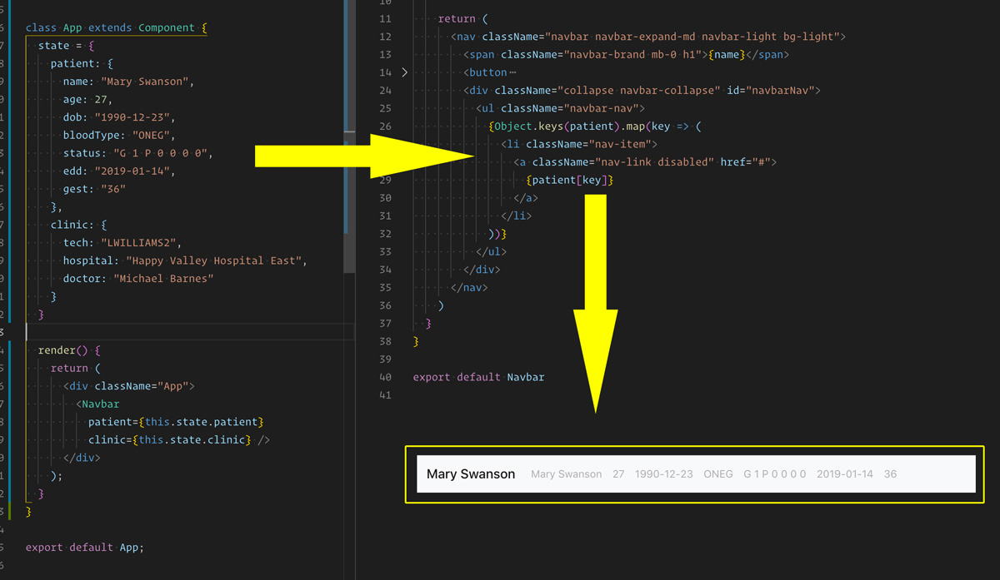

Data objects, returned from an API, can be pretty unwieldy, and dealing with the data they contain is not as straight-forward as dealing with something like an array. Conveniently, there are several methods we can use to extract data from these objects and turn them into something iterable. This blog post will cover **Object.keys()**, **Object.values()**, and **Object.entries()**.

## Starting Template
~~~javascript{numberLines: true}
function App() {
  const [data, setData] = React.useState({});

  // Replace every 30 requests: https://gorest.co.in
  const TOKEN = "Ygi5nTQHiWVeGM0t1yuEDiGyrYJGqHLruAIi";

  const API =
    "https://gorest.co.in/public-api/photos?_format=json&access-token=";

  const fetchData = async request => {
    const response = await fetch(request);
    const data = await response.json();
    setData(data.result);
  };

  React.useEffect(() => {
    fetchData(API + TOKEN);
  }, []);

  return (
    

  );
}

export default App;
~~~

On page load, **useEffect()** will fetch from our API and set its result as our **data** state. Once that data exists, we can explore it with our three **Object** methods in the return statement.

~~~javascript{numberLines: true}
return (
  

    {// If data exists...
    data.length &&
      data.map(dataObj => {
        // return the whole object
        console.log(dataObj);
        //> {id: "1", album_id: "572", title:.... }

        // return only the keys from the object
        console.log(Object.keys(dataObj));
        //> ["id", "album_id", "title", "url", "thumbnail", "_links"]

        // return only the values from the object
        console.log(Object.values(dataObj));
        //> ["19", "1315", "Et facilis error eaque aut", ...]

        // return key/value pairs from the object
        console.log(Object.entries(dataObj));
        //> 1: (2) ["album_id", "1315"]...
      })}
  

);
~~~

## So, how can we use these?

At first glance it may be tough to see the utility in these methods, but they're surprisingly useful.

For example, we can create new arrays that contain _some_ of the properties of our object, but removes the ones we don't need.

~~~javascript{numberLines: true}
// remove last element
 const newArr =  Object.keys(dataObj).slice(0, -1);

// remove select element
 const newArr2 =  Object.keys(dataObj).filter(key => key !== "_links");
~~~

The strangest part of this syntax, for me, is that in **Object.keys()**, `object[key] = value`. Used in **.map()**, that's just not intuitive to me.

However, within the code above, we can use this bracket notation and our freshly destructured keys to do something like cleanly wrap image thumbnails in a link to the full sized image.

~~~javascript{numberLines: true}
const imgSrc = "url",
  thumbSrc = "thumbnail";

const image = dataObj[imgSrc],
  thumbnail = dataObj[thumbSrc];

~~~

I first learned of **Object.keys()** in a technical interview that I bombed. I had trouble understanding it, but in my very next project found a perfect use for it (image below). It's a great resource to keep in your pocket.

