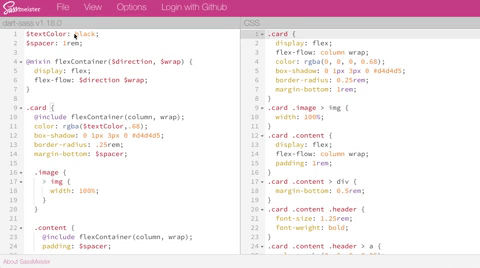

SCSS is the more popular of two syntaxes of the CSS preprocessor, **Sass**. It stands for "Sassy CSS," while Sass itself is an acronym for "Syntactically Awesome Stylesheets." The words "Sass" and "SCSS" are used interchangeably. A [CSS preprocessor](https://developer.mozilla.org/en-US/docs/Glossary/CSS_preprocessor) must be installed on your computer or server and will compile its unique syntax down to standard CSS.

SCSS is very similar to CSS in syntax, but brings along many advanced capabilities, like variables, mixins, and nesting, which allow for styling that is more flexible, readable, maintainable, and scalable.

~~~scss{numberLines: true}
/* SCSS
----------------------------*/
$textColor: black;
$spacer: 1rem;

@mixin flexContainer($direction, $wrap) {
  display: flex;
  flex-flow: $direction $wrap;
}

.card {
  @include flexContainer(column, wrap);
  color: rgba($textColor,.68);
  box-shadow: 0 1px 3px 0 #d4d4d5;
  border-radius: .25rem;
  margin-bottom: $spacer;
  
  .image {
    > img {
      width: 100%;
    }
  }
}

/* Compiled CSS
----------------------------*/
.card {
  display: flex;
  flex-flow: column wrap;
  color: rgba(0, 0, 0, .68);
  box-shadow: 0 1px 3px 0 #d4d4d5;
  border-radius: 0.25rem;
  margin-bottom: 1rem;
}
.card .image > img {
  width: 100%;
}
~~~

##Setting Up React to Use SCSS
With the release of [Create React App 2.0](https://reactjs.org/blog/2018/10/01/create-react-app-v2.html), React is better prepared to use Sass, as well as two other features we'll get to later, CSS Modules and PostCSS. Follow along below to convert your project to Sass.

~~~
npx create-react-app scss-in-react
~~~
Open **Terminal** and spin up a new React application with create-react-app:

~~~
cd scss-in-react
~~~
Move into your new project directory

~~~
npm install node-sass
~~~
Install node-sass

~~~
cd src
mv App.css App.scss
mv index.css index.scss
~~~
Change your file extensions from CSS to SCSS

~~~javascript{numberLines: true}
// src/index.js
import React from 'react';
import ReactDOM from 'react-dom';
import './index.scss'; // change from index.css

// src/App.js
import React from 'react';
import Card from './components/Card'
import CardModule from './components/CardModule'
import './App.scss'; // change from App.css
~~~
Change the file extensions in your imports

Annnnnddddd... you're done! At this point you can safely write SCSS into **index.scss** and **App.scss** and it will run perfectly in your browser.

##But, Why?

CSS preprocessors like Sass help keep things *DRY*. You only have to write a class name one time, or change it in one place to receive those changes across your entire app. Some would even call this object oriented CSS.

Click the image to play with the code on Sassmeister

Many popular CSS frameworks come in Sass versions. These are ideal for production applications because you are able to pick and choose code from the components you plan to use and skip the ones you aren't.

With Sass, instead of loading an entire framework to get a card component or button, you can **@include** only the component(s) you'll use in your build.

~~~
npm install foundation-sites --save
~~~
Install via Terminal

~~~scss{numberLines: true}
@import 'foundation';

@include foundation-card;
//@include foundation-button;
//@include foundation-tooltip;
// ...
~~~
Import components as needed!

##CSS Modules
For many years, and often still today, websites included a single CSS file in the site **<head>** that contained all styles for a website.

This presents a few problems:
1. CSS is render blocking. The entire file has to load in the before the browser starts loading the website's content. CSS file sizes can be huge, especially if you're loading a whole framework of styles you don't plan to use.

2. If you don't include CSS in your \<head\>, the site will load with no styles and then suddenly *flash* to your actual design. This is called a FOUC: a Flash of Unstyled Content.

3. CSS selectors are global. Even if you start with the best intentions, as a project grows you'll end up writing crazy selectors or, worse, using the **!important** tag to force overwrites for content that's in no way related and not on the screen at the same time.

### CSS Modules to the Rescue
... But they're going to require their own blog post.